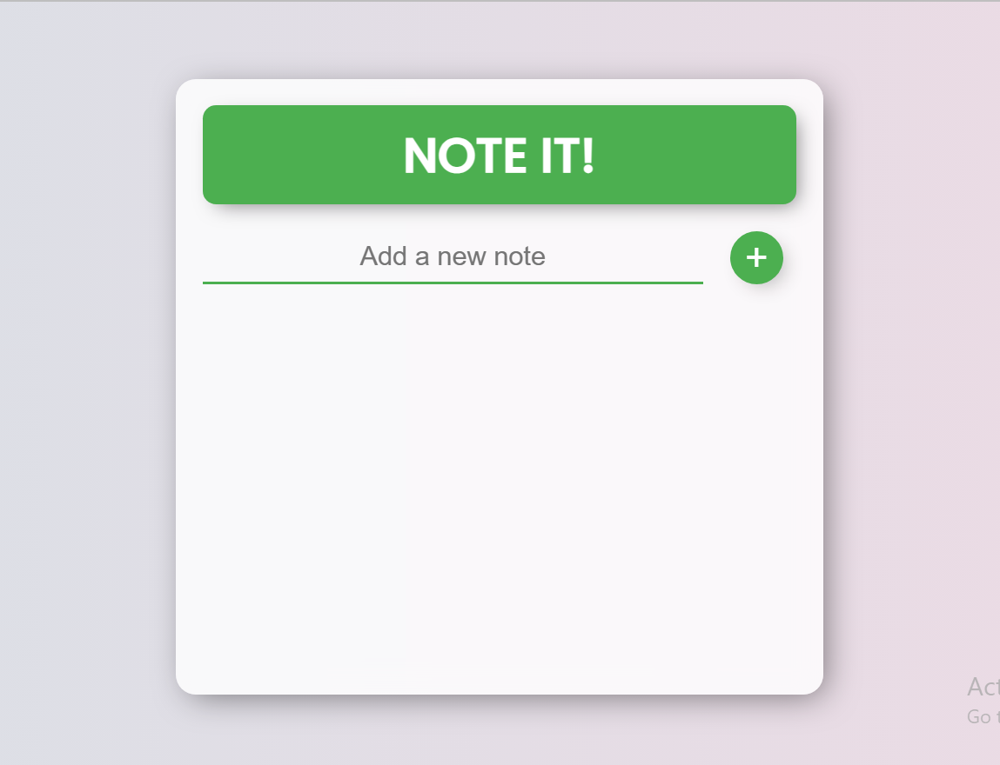
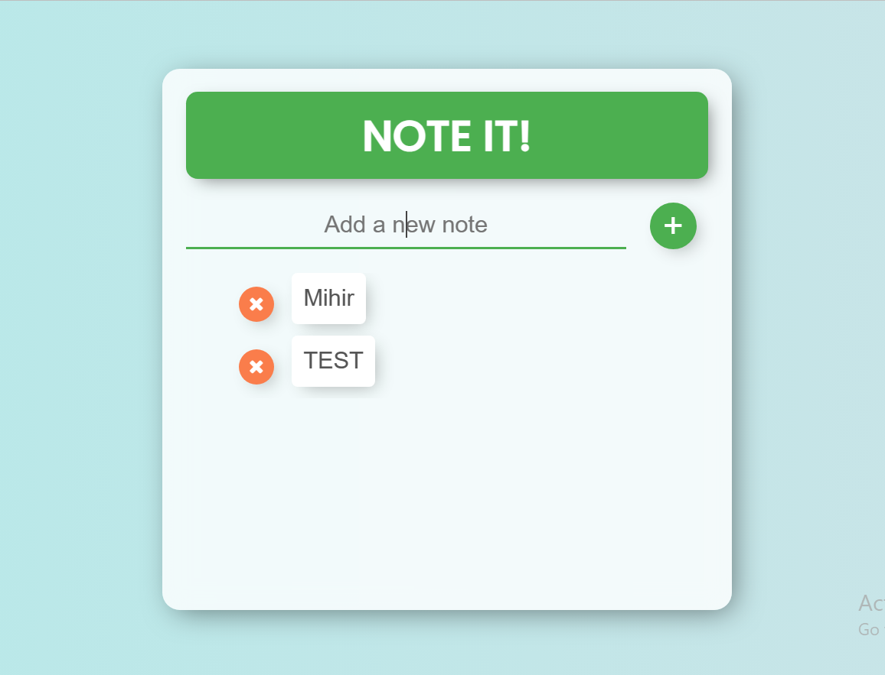

# Note It! - React App

Note It! is a simple note-taking application built using React. Users can add, delete, and view their notes in a user-friendly interface.

## Features

- Add a new note by typing in the input field and clicking the "+" button or pressing Enter.
- View a list of all added notes with the ability to scroll if necessary.
- Delete a note by clicking on the cross (x) icon next to it.
- Responsive design for optimal viewing on different devices.

## Technologies Used

- React: A JavaScript library for building user interfaces.
- HTML/CSS: Markup and styling for the application.
- Font Awesome: Icons used for the delete functionality.
- Google Fonts: Custom font used for the heading.

## Installation

To run the application locally, follow these steps:

1. Clone the repository: `git clone https://github.com/your-username/note-it-reactjs.git`
2. Navigate to the project directory: `cd note-it-reactjs`
3. Install the dependencies: `npm install`
4. Start the development server: `npm start`
5. Open your browser and visit `http://localhost:3000` to see the application in action.

## Folder Structure

```
note-it-reactjs/
  ├── src/
  │   ├── components/
  │   │   └── Notes.jsx
  │   ├── App.jsx
  │   ├── index.js
  │   └── index.css
  ├── public/
  │   └── index.html
  ├── package.json
  ├── package-lock.json
  └── README.md
```

- The `src/components` folder contains the `Notes` component used to render individual notes.
- The main application logic and components are in `App.jsx`.
- The `index.js` file is the entry point of the application.
- The `index.css` file contains the styles for the application.
- The `public` folder contains the `index.html` file and other static assets.
- The `package.json` and `package-lock.json` files manage the project's dependencies.

## Screenshots





## Contributions

Contributions are welcome! If you have any suggestions, bug reports, or feature requests, please open an issue on the [GitHub repository](https://github.com/axewhyzed/note-it-reactjs).

## License

This project is licensed under the MIT License . Feel free to use and modify the code for personal and commercial purposes.


